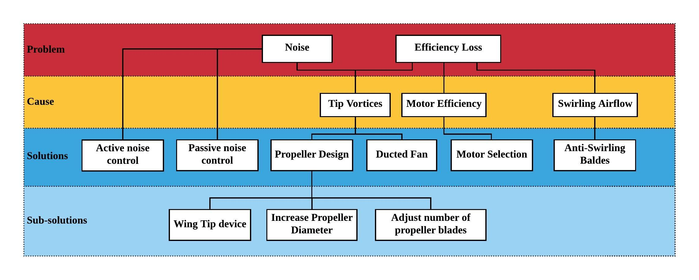
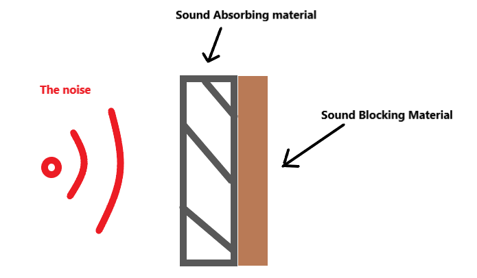
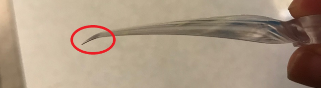
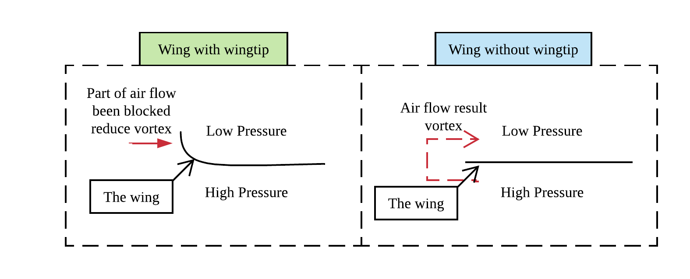
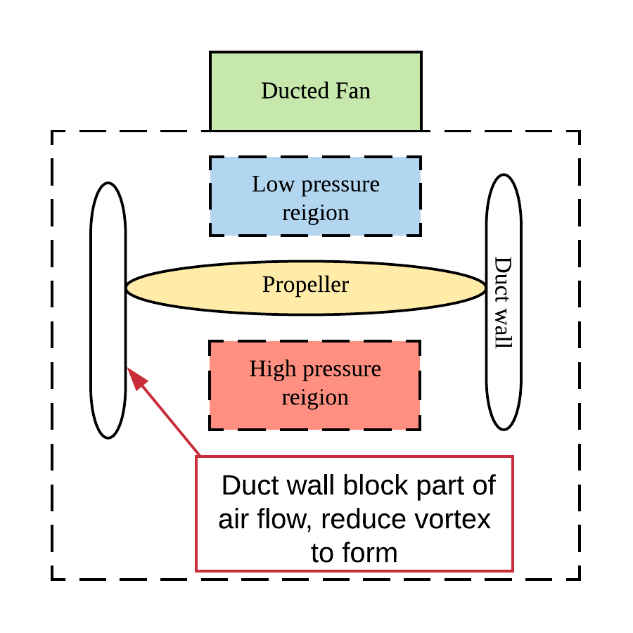
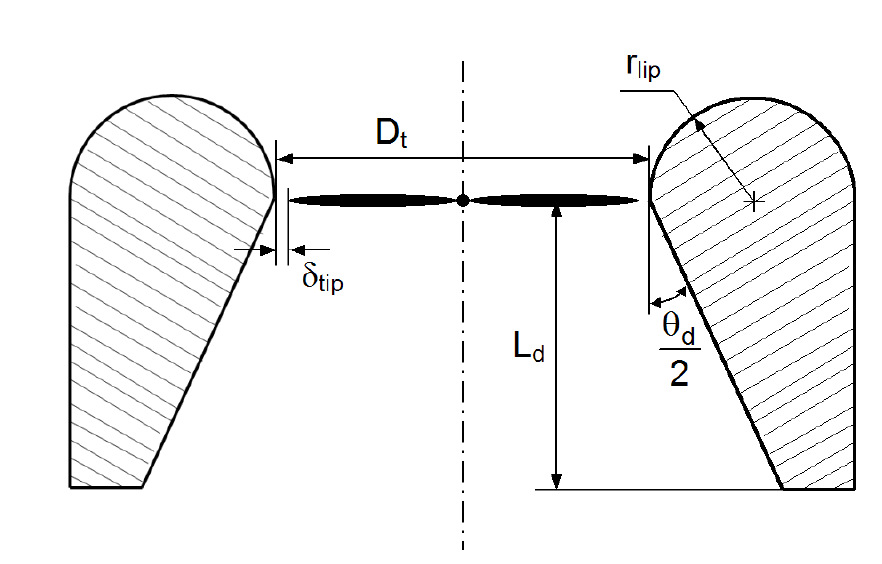
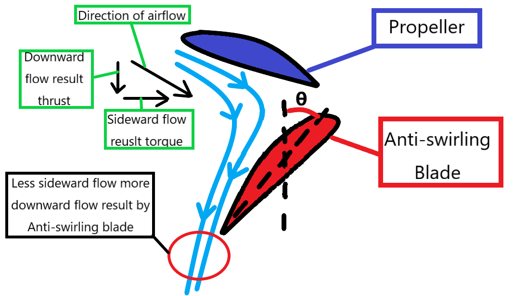
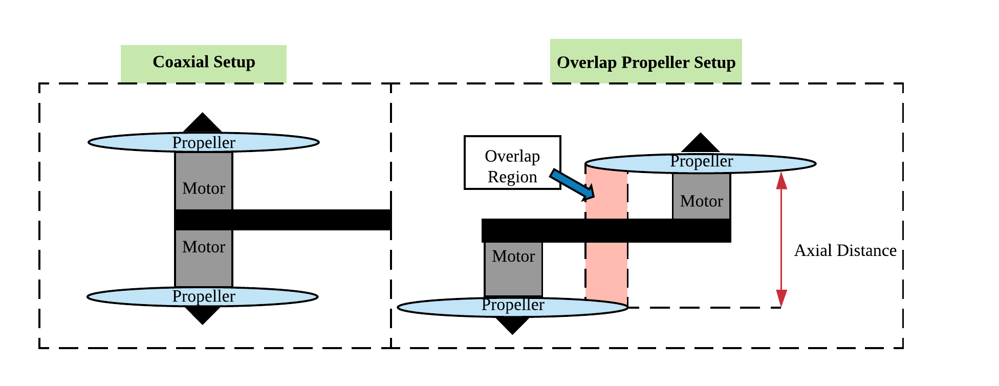

# Hardware Research

## Summary

The report describes the internship project carried out in a TU/e student team, Blue Jay. Blue Jay is a team that focuses on indoor drone application. Therefore, the team wishes to minimize the produced noise to improve user experiences. On the other hand, the team also wishes to improve the flying efficiency for benefiting flying time. As result, the project is about making the flying drone more efficient with less noise emitted during the operation. For producing design to approach the problem, design methodology that learned previously in Fontys has been applied. In the end the ducted fan design has been chosen through studied theory and experimenting. However, there are two additional requirements, an increase in amounts of sensors and an increase in propeller numbers to increase safety. These additional requirements result the drone has less flying time due to the increase in weight. However, the selected design still improved the efficiency of selected propeller.

The report is trimmed down a lot because it was too large for the clover documentation. In order to seen the full report in pdf, you can send an email to info@bluejayeindhoven.nl. The Table of contents of the full report is also shown below to get an idea about what topics are missing. We have chosen to put chapter 3 in here, because it will show some relevant drone theory and design choices that one could make. This can add as an addition to the clover drone, and one is therefore able to adjust the clover drone for their specific application. Also the Conclusion and Recommendation is added. This is for everyone to see the results that some improvements can have and to give some recommendations to go beyond the information of the report and improve a drone design even more. 

Table of Contents

[Preface ii]()

[Summary ii]()

[1. Introduction 1]()

[Problem Definition 1]()

[Problem Analysis 2]()

[Goal 2]()

[Methodology and Strategy 2]()

[2. The Design Requirements, Functions, and Design Priority 3]()

[3. Studied Theory & Possible Design Choices 9]()

[Active and Passive Noise Controlling 9]()

[Propeller Design 10]()

[Ducted Fan 12]()

[Motor Selection 13]()

[Anti-Swirling Blades 14]()

[Multirotor setup 14]()

[Generated Morphological Chart 16]()

[4. Efficiency and Noise Testing & Design Choice 19]()

[General Experiment Setup 20]()

[Experiment on Types of Frame 21]()

[Experiment on Available Propeller Design 24]()

[Experiment on Effect of Duct, Anti-swirling Blade & Passive noise control 26]()

[Kesselring Method & Final Design Choice 31]()

[5. Design Optimization 33]()

[Optimization on Motor Choice 33]()

[Duct Design Optimization 35]()

[Duct Manufacturing Optimization 36]()

[6. Evaluation of Final Design 37]()

[7. Conclusion 41]()

[8. Recommendation 42]()

[Bibliography 43]()

[Appendix A: Organization Information and Planning 46]()

[Appendix B: Designed Drone Frame 49]()

[Appendix C: Applied Design Methodology 52]()

[Appendix D: Required components for the Drone 57]()

[Appendix E: Studied Theory 58]()

[Causes of Loss in Efficiency 58]()

[Causes of Noise 59]()

[Effect on Different Types of Multirotor Setup 60]()

[Further information about the duct 62]()

[Appendix F: Calculation Demonstration 63]()

[CAD drawing for determine maximum diameter of different drone setup 63]()

[Calculation process of table 8 64]()

[Calculation process of table 18 64]()

[Calculation process of hovering time 65]()

[Nose level on the side at hovering calculation 66]()

[Appendix G: Experiment Setup 66]()

[Used Motor and Propeller 67]()

[Determining Applied Propeller diameter 67]()

[Determining Geometry and Parameter of the Duct 70]()

[Appendix H: Thrust Stand Construction 72]()

[Appendix I: Data Recorded from Experiment 74]()

[Appendix J: Flow Simulation Setup 80]()

[CAD Drawing and Assembling 80]()

[Simulation setup 84]()

## 3. Studied Theory & Possible Design Choices

After studied of related theory, **when considering a single propeller**, the cause of noise and efficiency loss and the possible solutions are summarized in the figure below:

Figure Summary of possible design choice

In short, the noise generated by propellers are mainly due to vortices that form on tips when a propeller is spinning, and those vortices will also result in a loss in propeller efficiency. Moreover, the spinning motion will cause the air swirling, which will result part of energy be transformed into torque, rather than thrust. This leads to further efficiency loss. Lastly, the efficiency of motor that drives the propeller will also affect the overall efficiency of a propeller system. Further explanation on how noises are form and efficiency get lost can be found in Appendix E.

And **when considering propellers on the drone, the setup of propellers will also affect noise and efficiency.**

### Active and Passive Noise Controlling

For noise reduction there are mainly two ways, the active and the passive method. The active method is done by setting up a system that can generate sound that is completely out of phase of the noise, which will result noise canceling. However, for active noise canceling, reflected sound wave inside the room will be deadly \[6\]. Furthermore, active noise canceling has limitations in direction, which means that only in a specific region noise would be eliminated. Therefore, for more a completely recovery of the drone’s noise, a series of speakers will be required to produce anti-phase sound wave in multiple direction. This might significantly increase weight the drone.

The passive method is about creating a structure that isolates part of noise, for example create a cover around the source of noise to reduce the amount of noise emitted to the environment \[7\] \[8\]. As figure 5 shows, to create such sound isolation device both sound absorbing material and sound blocking material are needed. When the sound absorbing material reduces echoing of noise. And sound blocking material reduce noise emitted by making sound transportation more difficult. Additionally, when implementing passive noise control methods, the weight can also significantly increase due to added construction.

Figure How sound absorbing material should be applied for noise reduction

### Propeller Design

The propeller design affects the propeller performance the most, and it can be summarized into the propeller diameter, the numbers of blades, and the geometry of propeller.

And for the noise and efficiency of propellers following equations can be applied.

Equation 1 is the momentum theory that can be applied for knowing the minimum power consumption for an ideal propeller \[9\]. Equation 2 is showing the blade passage frequency that can be used to estimate frequency of the noise \[10\] \[11\]. Equation 3 shows that the power of emitted noise is proportional to square of the blade diameter and fifth power of propeller tip speed.

There are three facts can be found out from the aforementioned equations.

Firstly, when two propellers with different diameter are producing same thrust, the one has larger diameter will be more efficient since it requires less power to produce such thrust.

Secondly when the number of blades of propeller increases, the frequency of the noise will increase. A higher frequency noise is usually more absorbable. Which makes it more likely that the noise will be absorbed by environment, resulting in a lower noise level \[13\]. This also makes the noise reduction easier \[7\].

Lastly, equation 3 shows that emitted noise power is proportional to the rotation speed and diameter of a propeller. Therefore, at the same rotation speed the propeller with a smaller diameter will emitted less noise. However, by experiment made by Timothy and his partners \[12\] , when two propellers with different diameter produce the same level of thrust. The one with larger diameter will result lower noise due to larger propeller significantly reduce the propeller tip speed at the specific thrust.

In short, **when the same numbers of propeller going to be used on a drone \(thrust require for each propeller is the same regardless to weight of propeller\). Increasing the diameter of propeller will result improvement in efficiency and noise level.** And increase in numbers of blades may result improvement in noise level. However, whether different number of blades will affect efficiency significantly still need to be investigated. **Such experiment can be found in chapter 4.**

On the other hand, the main cause of efficiency loss and noise is due to tip vortices of propellers. Propeller geometry that helps vortices reduction will also be helpful. For example, applying wingtip device as shown in figure 6.

Figure Wingtip devices on commercial propeller

Such wingtip geometry will help to block part of air flow from bottom of the propeller to the top, resulting in a reduction in vortex formation, as shown in figure 7.

Figure How wingtip device work

### Ducted Fan

A duct that shrouded the propeller with a very small gap between the propeller and the duct wall is also a solution to reduce tip vortices and to increase efficiency while having a lower noise level. This concept works similar to a wingtip device; the duct becomes a barrier that reduces amount of air that can flow from the high-pressure region to the low-pressure region. This process is being demonstrated in figure 8.

Figure How duct reduce vortices

Furthermore, the research done in 2008 by Pereiral \[14\] \[15\] were he conducted an optimal design feature of a duct for propeller. This design has the potential to result 94% more thrust or saving 62% power compared to same propeller which is not ducted. This implies a 260% increase in efficiency \(g/W\). The geometry of the duct is shown in figure 9.

Figure Cross-section view of the optimal duct \[14\]

How the duct shape further improves efficiency is explained in Appendix E. Pereiral’s research also mentions that generally an increase in and a decrease inwill result improvement in efficiency. In practical, as lip radius increases, the weight and drag production will also increase. Additionally, the value ofis limited by the manufacturing technique.

The paper of Pereiral also provides the optimal dimensions of the duct that were carried out through experiment in relations to propeller diameter. Which are shown below:

### Motor Selection

For motors applied for multirotor drones, the efficiency of the motor itself is usually not specified. Instead, the manufacturer provides the KV value of the motor. What it present is the approximate maximum rpm of the motor per voltage input. For example, a 1400 KV motor driven by 10 V input current has a maximum rpm around 14000 when there is no load. Generally, motors in same size with the lower the KV have higher torque \[16\] \[17\], which is due to the increase in numbers of winding in the rotor. As a result, lower KV motors are usually more efficient since it consumes less current to overcome the drag induced by propeller \[17\]. Nevertheless, when the KV value is too low, the maximum thrust will not be sufficient to lift the drone. **Therefore, to improve motor efficiency, the selected motor will have the lowest KV value, while the maximum thrust of the system is still sufficient.**

### Anti-Swirling Blades

When encountering swirling air, a swirl recovery stator or anti-swirling blade shown in figure 11 can be applied. The stator is basically a non-rotating propeller that directs air to a direction inverse to direction of the swirl, while acting as the support structure that holds the motor. However, the stator can also lead to more frictional loss due to the air now have to pass through an extra surface. Also, the presence of the stator may result in higher noise generation. \[18\] Since now the stator will try to direct air molecules there will be more collision when the air passed through. And since the motor will be held by an arm or supported rib on the drone, an anti-swirling blade can be considered as a supporting structure with specific geometry. This has the benefit of not causing much incremental weight.

Figure How swirl recovery stator functions

### Multirotor setup

For multirotors, there are mainly four options about how to place propellers. The four setups of the drone frame are pusher, tractor, overlapping, and coaxial. Those setups are demonstrated in figures below.

Figure Pusher and Tractor Setup of Drone

Figure Coaxial and Overlap Propeller Setup

The effect of different setup can be summarized by table 5 below:

<table>
  <thead>
    <tr>
      <th style="text-align:left"></th>
      <th style="text-align:left"><b>Pusher</b>
      </th>
      <th style="text-align:left"><b>Tractor</b>
      </th>
      <th style="text-align:left"><b>Overlapping</b>
      </th>
      <th style="text-align:left"><b>Coaxial</b>
      </th>
    </tr>
  </thead>
  <tbody>
    <tr>
      <td style="text-align:left"><b>Pros</b>
      </td>
      <td style="text-align:left">Higher static thrust efficiency [19] [20]</td>
      <td style="text-align:left">Higher dynamic thrust efficiency [19] [20]</td>
      <td style="text-align:left">Requires less space for placing propellers</td>
      <td style="text-align:left">Requires less space for placing propellers</td>
    </tr>
    <tr>
      <td style="text-align:left"><b>Cons</b>
      </td>
      <td style="text-align:left">
        
1.Lower dynamic thrust efficiency [19] [20]

        
2.Requires more space for placing propellers

      </td>
      <td style="text-align:left">
        
1.Lower static thrust efficiency [19] [20]

        
2.Requires more space for placing propellers

      </td>
      <td style="text-align:left">Overlap region result in more noise and efficiency loss [20] [21] [22]</td>
      <td
      style="text-align:left">Overlap region result in more noise and efficiency loss [20] [21] [22]</td>
    </tr>
    <tr>
      <td style="text-align:left"><b>Note</b>
      </td>
      <td style="text-align:left"></td>
      <td style="text-align:left"></td>
      <td style="text-align:left">Overlap of 10~15% of the propellers&#x2019; diameter with the minimal
        axial distance may result in no drop efficiency [20]</td>
      <td style="text-align:left"></td>
    </tr>
  </tbody>
</table>

Table Summary about different multirotor setup

Moreover, the multirotor needs same amount of propeller rotates in clockwise and counterclockwise direction for balancing the torque. And the flight controller of Blue Jay drones supports a maximum of 8 motors. To meet the requirement of **having more than four propellers that stated in table 2**, only hexacopter and octocopter setup will be possible.

## 7. Conclusion

The main question _**“What is the optimal hardware design solution regarding noise and efficiency that is applicable in the drone that has all required functions?”**_

has been answered through design process and find out to be the ducted fan design.

From the evaluated result, when the duct was applied the efficiency and noise level of a propeller did have improvement. The efficiency improvement between 30~40% has been reached when the ducted fan and normal propeller is producing the same thrust. However, the 30~40% efficiency improvement is very low compare to the 260% efficiency improvement that stated in the researched value. Further, the ducted fan design in the end does not have more efficiency than the propeller used in last year. This fact shows the drawback in efficiency caused by reducing propeller diameter is difficult to recover. This reduction of propeller diameter is caused by the safety requirement forces an increase in the number of propellers, while the width requirement still holds.

For the noise reduction, due to the increment of weight made by the duct, the noise reduction benefit can easily disappear.

Lastly, though the applied design did have improve on efficiency compared to same size propeller. The additional components result the estimated flying time of the drone does not increase, instead decrease for about 1.5 minutes.

## 8. Recommendation

From the evaluated result, it has been found out that the flying time gets reduced mainly due to the increase in weight without further increment of efficiency. And the main reason for efficiency not getting further improvement is due to reduction of propeller diameter. Therefore, it is suggested to have more research on how much safer the drone becomes when more propellers are used. The maximum width also has to be researched. If it has been found out that the increment in propeller numbers is not necessary, the efficiency can further improve by using propellers that have a larger diameter. Also, if the width requirement is larger than the current drone, the diameter of propeller can also increase.

To improve the efficiency, it has been found out ducting the propeller is very useful. However, the manufacturing technique can be further improved. Therefore, it is suggested for the team to search other technique to produce a higher quality duct.

Additionally, for noise reduction the benefit brought by the duct can disappeared due to increment in weight. As a result, it is suggested to do more research on how to minimize the duct weight with same efficiency improvement.

Moreover, the design has been carried out through static measurement, which may be different when the drone is flying. The added duct may also affect the controllability of the drone. As a result, an investigation of drone performance when flying should be done for further evaluation of the design.

Last but not least, the ways to evaluate the drone performance should be standardized, so the drone produced by Blue Jay each year can be comparable. And with the comparable result, the team can define the goal of the drone each year with more detail and better-defined requirements.

## 

\*\*\*\*

